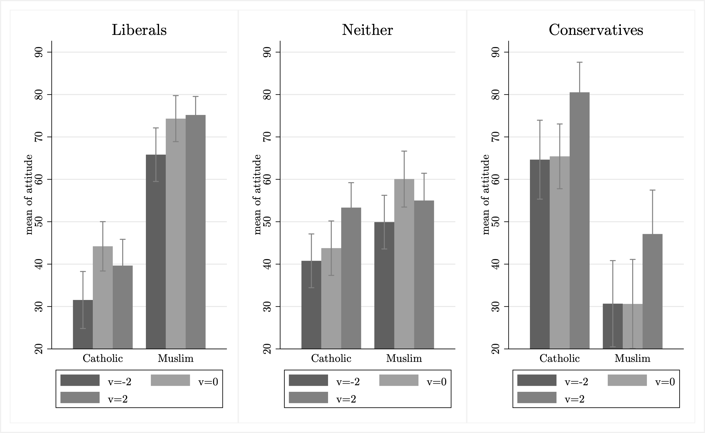

Media coverage of Muslims has been repeatedly shown to be negative, and attitudes toward Muslims in American society are typically more negative than attitudes toward other social groups. Does the tone of media coverage directly affect public attitudes? This relationship is not well established with respect to Muslims, nor as a proposition about social groups in general. We use an online between-subjects experiment to examine whether exposure to articles of quantifiably different valences about Muslims or Catholics affects reported attitudes toward each of those groups. We find clear support for this proposition. Our additional tests demonstrate that this effect persists but is attenuated when money is at stake. We also identify anxiety as a key mediator between exposure to articles of different valences and attitudes about each group. Our findings suggest that articles of a particular tone can influence views of social groups.

